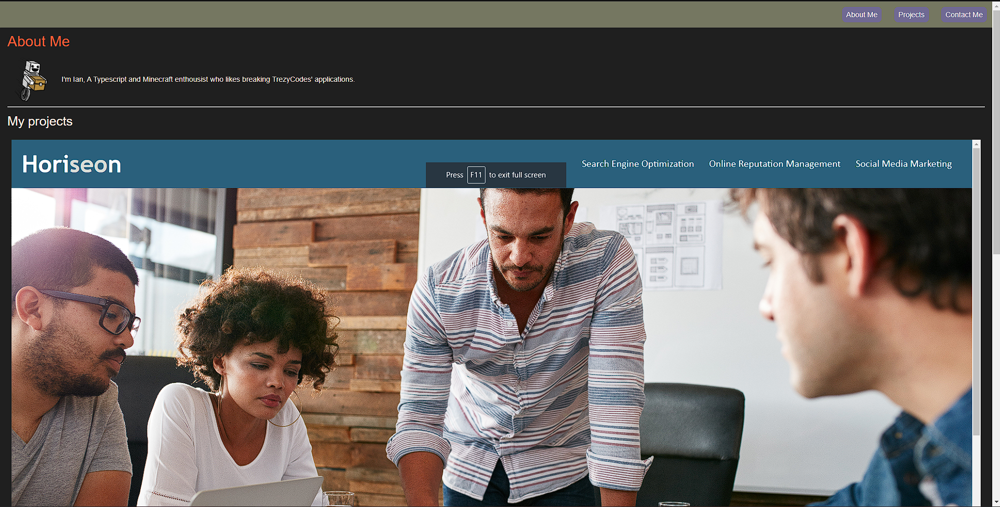

# Ian's Portfolio

Deployed on github pages, you can view it [here](https://ianssenne.github.io/portfolio/)

## Objective

To create a portfulio website to show off my projects.

## Technologies Used

| name       | usage                                       |
| :--------- | :------------------------------------------ |
| css        | used for styling the page                   |
| html       | used for defining the structure of the page |
| javascript | used for basic templating of components     |
| prettier   | used for formatting of files                |

## The Final Version of the horiseon webpage



## features

- a primary project slot.
- contact info
- navigation to each section
- a basic component system using the `<template>` element

## configurations

### .prettierrc

```json
{
	"useTabs": true
}
```
